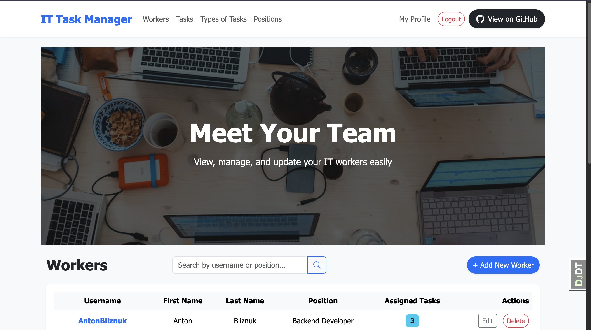
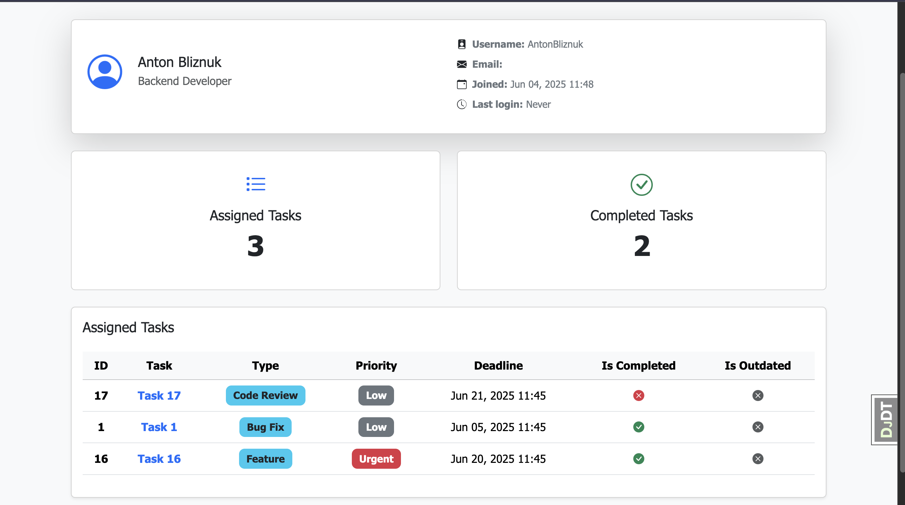
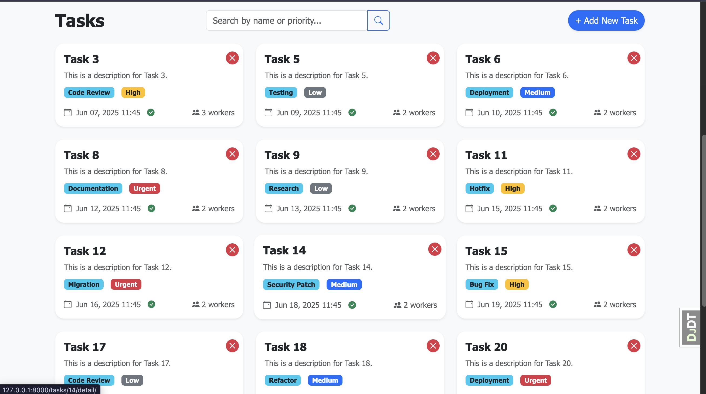
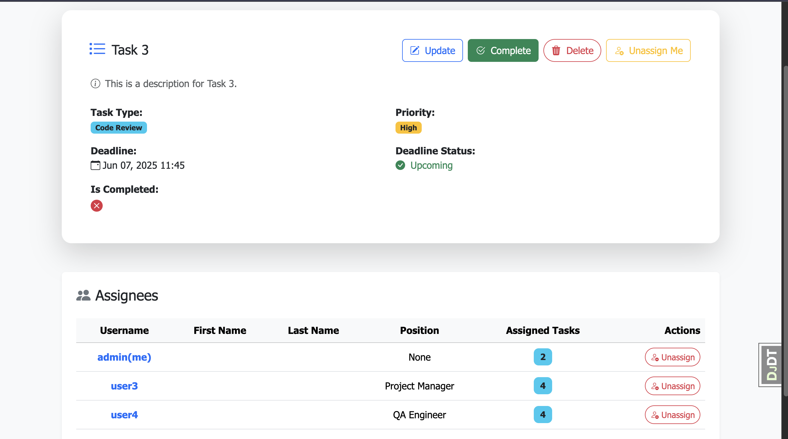

# 🚀 IT Task Manager
[Click here to visit the service](https://it-task-manager-nws5.onrender.com/)

**IT Task Manager** is a clean, simple, and fully open-source Django-based web application designed to help small startups, indie developers, and teams efficiently manage their projects and tasks.

With an intuitive interface, modern animations, and a sleek GUI, it's easy to use and even easier to modify or extend. Built with maintainability and clarity in mind, the codebase is perfect for both beginners looking to learn Django and developers who need a practical, lightweight task management tool.

---

## 🌟 Features

- 🔐 User authentication (login, logout)
- 🧑 Worker management (list, detail views, create, update)
- 📋 Task management (list, detail, update, assign)
- ✅ Status tracking for tasks
- 💅 Beautiful and responsive UI with smooth animations
- 🔍 Debug toolbar for development
- 🧼 Clean code with type hints and linting (Black, Ruff, Mypy)

---

## 🧰 Tech Stack

- **Backend:** Django 5.2.1
- **Frontend:** Django Templates + Crispy Forms + Bootstrap 4
- **Tools & Dev Dependencies:**  
  - `black`, `ruff`, `mypy` for code formatting and linting  
  - `django-debug-toolbar` for development insights  
  - `python-decouple` for managing environment variables  
  - `coverage` for test coverage reporting

---

## 📦 Installation

### 1. Clone the repository
```bash
git clone https://github.com/your-username/it-task-manager.git
cd it-task-manager
```

### 2. Set up a virtual environment
```bash
python -m venv venv
source venv/bin/activate  # Windows: env\Scripts\activate
```

### 3. Install dependencies
```bash
pip install -r requirements.txt
```

### 4. Set up environment variables
Create a .env file in the root directory:
```bash
SECRET_KEY=your-secret-key
```

### 5. Apply migrations
```bash
python manage.py migrate
```

### 6. Run the development server
```bash
python manage.py runserver
```
## Test user:
login: test_user

password: test_test123

---
## 🖼️ Screenshots

## 👥 Worker List Page


## 👤 Worker Detail Page


## 📋 Task List Page


## 📝 Task Detail Page
